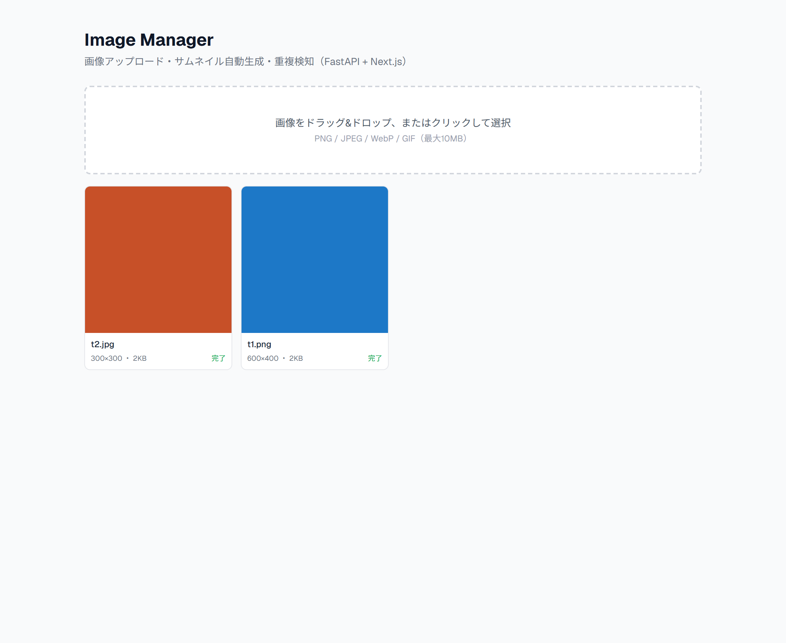

# Image Management System

画像アップロード・サムネイル自動生成・重複検知を備えた画像管理アプリ。FastAPI + Next.js のフルスタック構成。Portfolio Master Plan の Project 04。

**🔗 デモ: https://portfolio-04-image-manager.vercel.app/** ｜ **API: https://portfolio-04-image-manager-api.onrender.com/docs**

> バックエンドはRender無料枠のためスリープします（初回アクセスは起動に50秒ほど）。アップロードした画像は再起動でリセットされます（無料枠の仕様）。

## 概要

画像をアップロードすると、バリデーション → 保存 → **バックグラウンドでサムネイル生成** までを行います。
本プロジェクトのテーマは **ファイル処理・バックグラウンド処理・ストレージ設計** で、これまでの CRUD / 外部API / 認証 とは異なる「バイナリデータの扱い」を扱います。

## 使用技術

### バックエンド
- Python 3.12 / FastAPI（`UploadFile` / `BackgroundTasks`）
- Pillow（サムネイル生成・EXIF除去・画像検証）
- SQLAlchemy 2.0 / Alembic / PostgreSQL（開発は SQLite）
- pytest / Ruff

### フロントエンド
- Next.js (App Router) / React 19 / TypeScript (strict) / Tailwind CSS
- ドラッグ&ドロップ・アップロード進捗（XMLHttpRequest）

### インフラ / CI
- Docker / GitHub Actions（Ruff + pytest / ESLint + build）
- Render（API + PostgreSQL） / Vercel（フロント）

## 特徴（実務を意識した設計）

- **ストレージ抽象化**: `StorageBackend` 抽象 → `LocalStorage` 実装。将来 S3/R2 へ差し替え可能
- **SHA-256 重複検知**: 同一内容の画像は二重保存しない
- **状態管理**: PENDING → PROCESSING → READY / FAILED（UIで生成状況を表示）
- **多層バリデーション**: MIME + 拡張子整合 + **Pillow `Image.verify()`**（拡張子偽装対策）
- **ストリーム保存**: `UploadFile` を丸読みせずチャンクで保存（大きなファイルでもメモリを圧迫しない）
- **サイズ上限**: ストリーム中に監視し超過は 413
- **EXIF除去**: サムネイル生成時にGPS等のメタデータを除去（プライバシー配慮）
- **パストラバーサル対策**: 保存キーはUUIDベース

## アーキテクチャ

```text
Frontend (D&D, 進捗, グリッド)
      │  multipart/form-data
      ▼
Upload API (FastAPI)
      │  検証(MIME/拡張子/サイズ/Image.verify) + SHA-256重複検知
      ▼
ImageService
      ├── StorageBackend (抽象)
      │        ├── LocalStorage（現在）
      │        └── S3Storage（将来差し替え可能）
      │
      ├── BackgroundTasks ─→ Thumbnail生成(Pillow, EXIF除去, 256×256)
      │                          │
      │                          ▼  status: PENDING→READY
      └── ImageRepository (抽象) ─ SQLAlchemy実装
      ▼
PostgreSQL / SQLite（メタデータ）
```

「なぜ抽象化したか」= 保存先（ローカル/クラウド）を Service を変えずに差し替えるため。

## セットアップ

### バックエンド
```bash
cd backend
python -m venv .venv
.venv/Scripts/activate  # Windows
pip install -r requirements.txt
cp ../.env.example .env
alembic upgrade head
uvicorn app.main:app --reload
```

### フロントエンド
```bash
cd frontend
npm install
cp .env.example .env.local
npm run dev
```

### テスト
```bash
cd backend
pytest -v
```

## API一覧

| Method | Path | 説明 |
|---|---|---|
| POST | /images | 画像アップロード（同一sha256は既存を返す=200） |
| GET | /images?page=&limit=&sort=&order= | 一覧（ページネーション+ソート） |
| GET | /images/{id} | メタデータ |
| GET | /images/{id}/file | 画像本体を配信 |
| GET | /images/{id}/thumbnail | サムネイルを配信 |
| DELETE | /images/{id} | 論理削除 + ファイル削除 |
| GET | /health | ヘルスチェック |
| GET | /health/storage | Storage書き込み + DB接続の個別確認 |

| ステータス | 意味 |
|---|---|
| 201/200 | 新規 / 既存(重複) |
| 400 | 不正なファイル（MIME/拡張子/画像として開けない） |
| 413 | サイズ超過 |
| 404 | 対象なし |

## ディレクトリ構成

```text
portfolio-04-image-manager/
  backend/
    app/
      api/          # images, deps
      core/         # config
      models/       # image
      schemas/      # image, response
      services/     # image_service, thumbnail
      repositories/ # base(抽象) + sqlalchemy実装
      storage/      # base(抽象 StorageBackend) + local(LocalStorage)
      db/
      main.py
    migrations/     # Alembic
    tests/          # アップロード/検証/重複/一覧・ソート/削除/サムネイル/偽装拒否
  frontend/
    app/
    features/images/  # Uploader(D&D), Gallery, ImageCard
    services/         # imageApi
    types/
    lib/
  docs/requirements.md
  render.yaml
```

## スクリーンショット

### ギャラリー（サムネイル・状態表示）


## デプロイ

- フロント: Vercel（Root Directory=`frontend`） / API: Render（Docker, Free）
- 無料枠のディスクは揮発するため、再起動でアップロード済みファイルはリセットされます。本デモではメタデータも SQLite（揮発）で運用し、ファイルとメタデータの状態を一致させています（無料PostgreSQLはアカウントに1つの制限があり、Project 03 で使用中のため）。
- 実運用では `StorageBackend` を S3/R2 実装に、DBを PostgreSQL に差し替える想定です（コードは `postgres://` の正規化・`DATABASE_URL` 切替に対応済み）。

## 今後の改善点

- S3/R2 ストレージ実装への差し替え
- WebP変換 / ZIP一括ダウンロード / 画像検索
- 認証を追加し、ユーザーごとの画像管理（`owner_id`）
- Project 05（AI）との連携：アップロード画像のAI解析
